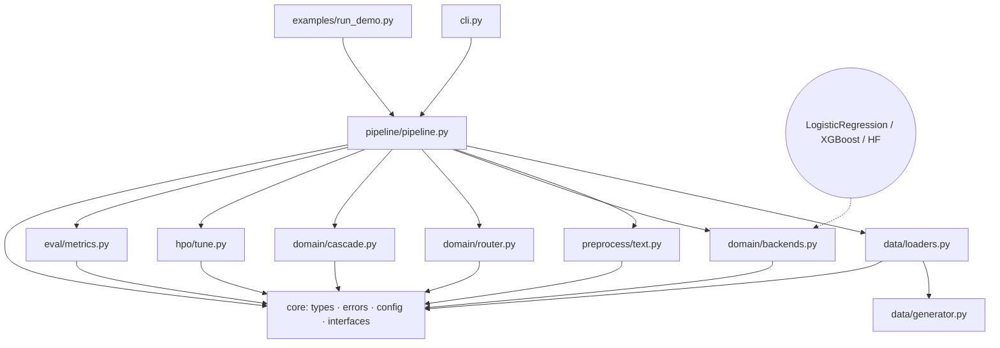

# IntentForge — Architecture

> Confidence-Calibrated Cascaded Routing for text classification.
> Author: 晨星

## 1. Problem & positioning

Running one strong model on every request pays the strong model's cost on the
large share of samples a cheap model already gets right. IntentForge turns this
into a **per-sample routing decision**: route easy requests to a fast backend,
escalate only the uncertain ones, and *abstain* instead of guessing when even
the strong model is unsure.

Target workload: multi-class short-text classification (intent recognition),
CPU-only commodity hardware.

## 2. Module map (single responsibility)

Call graph is **unidirectional and acyclic**:



| Module | Responsibility | Must NOT do |
|---|---|---|
| `core/types.py` | Cross-module dataclasses (`Prediction`, `RouterDecision`, `BenchmarkReport`) | contain ML logic |
| `core/errors.py` | Stable error taxonomy `E100–E500` | raise bare `Exception` |
| `core/config.py` | Config + `INTENTFORGE_*` ENV overrides | read data |
| `core/interfaces.py` | `Protocol` contracts for swappable parts | hold implementations |
| `data/generator.py` | Deterministic synthetic intent corpus (offline) | depend on network |
| `data/loaders.py` | `builtin` / `csv` / `newsgroups` loaders (`IDataLoader`) | train models |
| `preprocess/text.py` | Cleaning + shared TF-IDF factory | decide features per model |
| `domain/backends.py` | One adapter per OSS library (`ITextBackend`) | know about routing |
| `domain/router.py` | **C3R**: calibration + routing policy | train backends |
| `domain/cascade.py` | Batch cascade execution (accuracy path) | measure latency |
| `hpo/tune.py` | Optuna threshold search | evaluate final quality |
| `eval/metrics.py` | Quality + latency + memory measurement | make routing decisions |
| `pipeline/pipeline.py` | Orchestration: train → evaluate → benchmark → predict | implement ML directly |

### Why each is independently verifiable
Every module has unit tests that need no other module beyond `core`
(`tests/test_*.py`), plus minimal examples in the CLI (`predict`).

## 3. Contracts

### `ITextBackend`
| Item | Contract |
|---|---|
| Input (fit) | `List[str]` texts, `List[str]` labels |
| Output (predict) | `List[Prediction]` with `label`, `label_id`, `confidence = max p(y|x)`, `proba` summing to 1 |
| Protocol | in-process Python; no shared mutable state between calls |
| Errors | `E301` import missing · `E302` fit failed · `E303` predict before fit |
| Invariant | `sum(proba.values()) == 1 ± 1e-5`; labels ∈ `classes_` |

### `IRouter` (C3R)
| Item | Contract |
|---|---|
| Input (fit) | backends dict + held-out calibration texts/labels |
| Input (stage1) | single `Prediction` from the fast backend |
| Output (stage1) | `(is_confident, calibrated_confidence)` |
| Input (stage2) | fast + strong `Prediction` |
| Output (stage2) | `RouterDecision(chosen_backend, confidence, abstain, reason)` |
| Errors | `E401` calibration failed · `E402` routing failed |
| Invariant | decisions identical for batch (`route`) and lazy (`stage1`+`stage2`) paths |

### `IDataLoader`
| Item | Contract |
|---|---|
| Output | `{X_train, y_train, X_val, y_val, X_test, y_test, labels}` |
| Errors | `E200` data unavailable / empty |

### Error taxonomy
| Code | Meaning |
|---|---|
| `E100` | config / env override invalid |
| `E200` | data load / split failure |
| `E301` | optional backend dependency missing (→ offline fallback) |
| `E302` | backend fit failure |
| `E303` | backend predict failure / predict before fit |
| `E401` | router calibration failure |
| `E402` | router decision failure |
| `E500` | pipeline misuse (e.g. evaluate before train) |

## 4. Innovation: C3R

Let ``c_b(x) = max_y p_b(y|x)`` be backend *b*'s raw confidence. Raw scores from
tree ensembles and linear models are **not** probabilities, so comparing them
against a threshold is unsafe. C3R learns a monotone map per backend:

```
g_b = IsotonicRegression fitted on  ( c_b(x_i), 1[pred_b(x_i) = y_i] )   over a calibration set
```

`g_b(c)` estimates "probability the fast backend is correct". Policy:

```
if g_fast(c_fast) >= tau_high:          use fast            (cost: fast only)
elif g_strong(c_strong) >= tau_low:     escalate to strong  (cost: fast + strong)
else:                                   abstain            (do not guess)
```

`tau_high` / `tau_low` are tuned by Optuna to maximize macro-F1 while keeping a
healthy share of requests on the fast path.

**Two execution modes, identical decisions:**
* *Batch eager* (`cascade.py`) — predicts all backends once; used to measure **accuracy**.
* *Lazy* (`pipeline._cascade_one`) — evaluates the strong backend **only when needed**; used to measure **latency** and to serve predictions.

The strong backend is therefore invoked on only
`1 − frac_fast` of requests, which is where the speedup comes from.

## 5. Performance baseline

Environment: **Windows 11 · Python 3.13.14 · CPU-only (no CUDA) · AMD Ryzen (16 logical cores) · 15.26 GB RAM**
sklearn 1.9.1 · xgboost 3.4.1 · optuna 5.0.0 · numpy 2.5.3. Dataset: 10 intents, 1 530 train / 600 test, seed 42. Latency = **per-request** (batch-of-1), 600 samples × 3 repetitions.

| Path | Accuracy | Macro-F1 | Latency p50 | Latency mean | Throughput |
|---|---|---|---|---|---|
| `sklearn_linear` (fast) | 0.8183 | 0.8247 | 1.0869 ms | 0.9466 ms | 1 056 /s |
| `xgboost` (strong) | 0.8267 | 0.8338 | 5.1284 ms | 4.9875 ms | 200 /s |
| **C3R cascade** | **0.8267** | **0.8338** | **2.1474 ms** | **2.1978 ms** | **455 /s** |

Derived:
* **2.27× faster** than always-strong (−55.9% mean latency) at **identical** accuracy / macro-F1.
* **+0.0091 macro-F1** over always-fast (0.8247 → 0.8338).
* Routing: **80.83% fast**, 1.67% escalated (final strong), **17.50% abstain**; strong backend actually invoked on **19.17%** of requests.
* Memory: **155.0 MB RSS** (start 157.3 MB), CPU-only.

Evidence: `benchmark.json` (committed, includes environment, versions and timestamp).

## 6. Offline fallback & graceful degradation

| Missing dependency | Behaviour |
|---|---|
| `xgboost` | `SklearnLinearBackend` only; cascade becomes pass-through + abstain. System still trains/serves (no cascade gain). |
| `transformers` / `torch` | `TransformerBackend` skipped; the two classical backends still run fully offline. |
| `psutil` | Memory reported as `0.0`; latency/quality unaffected. |
| `optuna` | HPO raises `E100`; set `hpo_enabled=False` to use fixed τ. |

No dataset download is required: the builtin loader is fully synthetic and seeded.

## 7. Known limitations

* Synthetic corpus — the numbers above characterize the *system*, not any real production corpus; absolute quality on real data will differ.
* The optional HuggingFace path is implemented but **not exercised** in this environment (no torch installed), so its baseline is unmeasured (marked ⚪ in the README).
* Abstention rate (17.5%) is high on this corpus by design; tune `tau_low` per-domain.
* Single-process, CPU-only; no batching server.

See README "Roadmap" for planned extensions.
